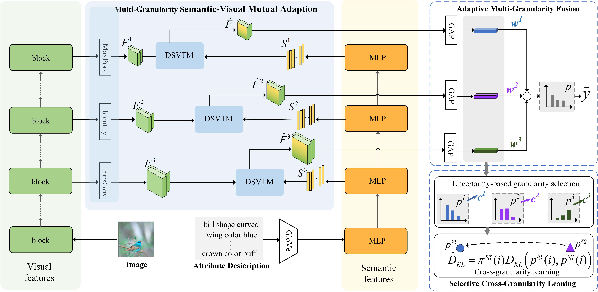

# PSVMAP
   [](https://pytorch.org/)
 This repository contains the reference code for the paper "[**PSVMA+: Exploring Multi-granularity Semantic-visual Adaption for Generalized Zero-shot Learning**](https://export.arxiv.org/abs/2410.11560)" accepted to TPAMI 2025.

## 🌈 Model Architecture



## 📚 Dependencies

- ```Python 3.6.7```
- ```PyTorch = 1.7.0```
- All experiments are performed with one RTX 3090Ti GPU.

## ⚡ Prerequisites
- **Dataset**: please download the dataset, i.e., [CUB](http://www.vision.caltech.edu/visipedia/CUB-200-2011.html), [AWA2](https://cvml.ist.ac.at/AwA2/), [SUN](https://groups.csail.mit.edu/vision/SUN/hierarchy.html) to the dataset root path on your machine
- **Data split**: Datasets can be download from [Xian et al. (CVPR2017)](https://datasets.d2.mpi-inf.mpg.de/xian/xlsa17.zip) and take them into dir ```../../datasets/```.
- **Attribute w2v**:```extract_attribute_w2v_CUB.py``` ```extract_attribute_w2v_SUN.py``` ```extract_attribute_w2v_AWA2.py``` should generate and place it in ```w2v/```.
- Download pretranined vision Transformer as the vision encoder.

## 🚀 Train & Eval
Before running commands, you can set the hyperparameters in config on different datasets: 
```
config/cub.yaml       #CUB
config/sun.yaml      #SUN
config/awa2.yaml    #AWA2
```
### The training:
```shell
 python train.py
```
### The testing:
Customize the paths of checkpoint and test set, and run:
```shell
 python test.py
```

You can download and test our [model](https://pan.baidu.com/s/15yzbyMYPnXCWoHknveoT-A) (password: vbme): CUB, AwA2, and SUN.

## ❗ Cite:
If this work is helpful for you, please cite our paper.

```
@ARTICLE{Liu_2025_TPAMI,
  author={Liu, Man and Bai, Huihui and Li, Feng and Zhang, Chunjie and Wei, Yunchao and Wang, Meng and Chua, Tat-Seng and Zhao, Yao},
  journal={IEEE Transactions on Pattern Analysis and Machine Intelligence}, 
  title={PSVMA+: Exploring Multi-Granularity Semantic-Visual Adaption for Generalized Zero-Shot Learning}, 
  year={2025},
  volume={47},
  number={1},
  pages={51-66},
  doi={10.1109/TPAMI.2024.3467229}}
```

## 📕 Ackowledgement
We thank the following repos providing helpful components in our work.
[GEM-ZSL](https://github.com/osierboy/GEM-ZSL)
